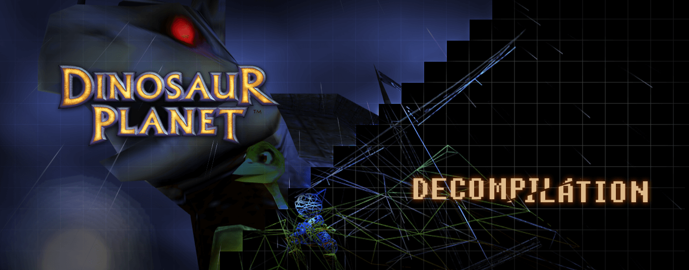

[](https://discord.gg/H6WGkznZBc) 
[](https://shinx.dev/dino-status/) 
[](https://shinx.dev/dino-status/)
[](https://shinx.dev/dino-status/)

A WIP decompilation of Dinosaur Planet for the Nintendo 64, as released by Forest of Illusion on Feb. 20, 2021.

**Note**: To use this repository, you must already have a ROM for the game.

```diff
- WARNING! -

This codebase is in an early research/development phase and the ROM this repository
builds is not 'shiftable', so cannot be used yet as a source code base for general changes.
```

## Development

### Git
This repository uses Git submodules. Make sure to either clone the repository with the `--recurse-submodules` flag or to run `git submodule update --init --recursive` after the initial clone.

When pulling updates, you can update all submodules with `git submodule update --recursive` or `./dino.py submodules`.

> Note: If you intend on developing inside of the Windows Subsystem for Linux (WSL), consider placing the repository on the WSL Linux partition. Builds are considerably slower when done on the Windows partition through WSL.

### Prerequisites

#### System packages

##### Linux / Windows Subsystem for Linux
- **Ubuntu**: `sudo apt install -y $(cat packages.txt)`
- **Other**: Other distributions will likely work. See your distro's package repositories for the following:
    - binutils-mips-linux-gnu
    - gcc
    - [ninja-build](https://ninja-build.org/)
    - python3

##### Windows 10+ (not recommended)
- [MSYS2](https://www.msys2.org/) with GNU GCC, GNU Binutils (MIPS target), and `base-devel`.
    - Please see the [MSYS2 for Decomp Setup Guide](./docs/MSYS2Guide.md) for instructions.
- Python 3.12+ (Microsoft Store version recommended)
- [Ninja](https://ninja-build.org/) (also available as [an MSYS2 package](https://packages.msys2.org/base/ninja))

#### Python 3 packages
`pip3 install -r requirements.txt`

### Setup
1. Place an unmodified Dinosaur Planet ROM into the root of the repository as `baserom.z64` (MD5: `49f7bb346ade39d1915c22e090ffd748`).
2. Set up tools and extract the ROM:
    - `./dino.py setup`
3. Build the ROM:
    - `./dino.py build`

### Rebuilding
1. If any symbols or the splat config were changed, re-extract the ROM and rebuild the linker script:
    - `./dino.py extract`
2. If any source files were added, removed, or renamed, re-configure the build script:
    - `./dino.py configure`
2. Rebuild the ROM:
    - `./dino.py build`

### Documentation
Please see the [docs](./docs) directory for project documentation such as:
- [an overview of the project](./docs/Overview.md)
- [a break-down of the ROM extraction and build system](./docs/Recompilation.md)
- [an introductory guide to decomp](./docs/Guide.md)
- and more!

### Tools
The repository comes with a bunch of tools for decompilation and managing the repository:
- `dino.py` - An all in one script for working with the repository. Some of the common commands:
    - `build` - Builds the ROM and verifies that it matches.
    - `configure` - Re-configures the build script.
    - `extract` - Splits the ROM and unpacks DLLs.
    - `clean` - Removes all extracted files, build artifacts, and build scripts for a fresh state.
    - `diff` - Diff a function/address between the base and re-built ROM.
    - `context` - Create a context file that can be used for mips2c/decomp.me.
- `tools/first-diff.py` - Find the first N differences between the base and re-built ROM.
- `tools/first_bin_diff.py` - Find the first N differences between two binary files.
- `tools/dlldump.py` - Dump headers, relocation tables, and assembly from a Dinosaur Planet DLL.
- `tools/dlldiff.py` - Finds differences between the base and re-built DLLs.

### Docker
If you prefer to develop inside of a Docker container instead of installing everything in your local environment, use the provided Dockerfile in the root of the repository.

Example usage:
```bash
# Create image
docker build -t dpdecomp --build-arg login=$USER --build-arg uid=$UID .

# Enter a bash prompt
docker run --rm -it -v $(pwd):/dino dpdecomp bash

# Run a one-off command
docker run --rm -it -v $(pwd):/dino dpdecomp dino build
```

## Contributing
Pull requests are welcome! Please see our [contribution guide](./CONTRIBUTING.md) for more information on how this project works and how to contribute.

If you're interested in contributing, please also consider joining us on Discord over at the [Dinosaur Planet Community server](https://discord.gg/H6WGkznZBc) in the `#decompilation` channel!
